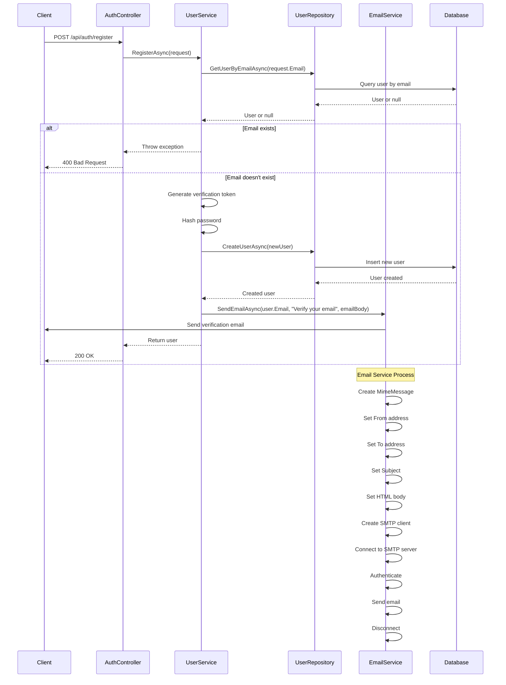

# Register and Email Verification Sequence Diagram

```mermaid
sequenceDiagram
    participant Client
    participant AuthController
    participant UserService
    participant UserRepository
    participant EmailService
    participant Database

    %% Registration Flow
    Client->>AuthController: POST /api/auth/register
    AuthController->>UserService: RegisterAsync(request)

    UserService->>UserRepository: GetUserByEmailAsync(request.Email)
    UserRepository->>Database: Query user by email
    Database-->>UserRepository: User or null
    UserRepository-->>UserService: User or null

    alt Email exists
        UserService-->>AuthController: Throw exception
        AuthController-->>Client: 400 Bad Request
    else Email doesn't exist
        UserService->>UserService: Generate verification token
        UserService->>UserService: Hash password

        UserService->>UserRepository: CreateUserAsync(newUser)
        UserRepository->>Database: Insert new user
        Database-->>UserRepository: User created
        UserRepository-->>UserService: Created user

        UserService->>EmailService: SendEmailAsync(user.Email, "Verify your email", emailBody)
        EmailService->>Client: Send verification email

        UserService-->>AuthController: Return user
        AuthController-->>Client: 200 OK
    end

    %% Email Service Flow
    Note over EmailService: Email Service Process
    EmailService->>EmailService: Create MimeMessage
    EmailService->>EmailService: Set From address
    EmailService->>EmailService: Set To address
    EmailService->>EmailService: Set Subject
    EmailService->>EmailService: Set HTML body
    EmailService->>EmailService: Create SMTP client
    EmailService->>EmailService: Connect to SMTP server
    EmailService->>EmailService: Authenticate
    EmailService->>EmailService: Send email
    EmailService->>EmailService: Disconnect
```
