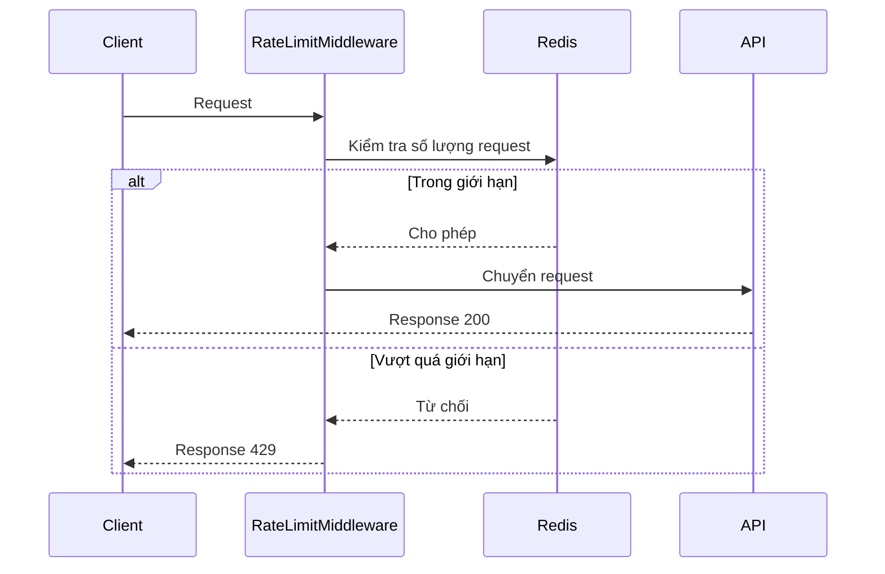

# Hướng dẫn Setup Rate Limiting

## Rate Limiting là gì?

Rate Limiting (Giới hạn tốc độ) là một kỹ thuật bảo mật và quản lý tài nguyên, trong đó hệ thống giới hạn số lượng request mà một client (người dùng, IP, API key) có thể gửi đến server trong một khoảng thời gian nhất định.

## Tại sao cần Rate Limiting?

1. **Bảo vệ tài nguyên server**:
   - Ngăn chặn quá tải server do quá nhiều request
   - Đảm bảo server có đủ tài nguyên xử lý các request hợp lệ
   - Tránh tình trạng DoS (Denial of Service)

2. **Bảo mật**:
   - Ngăn chặn brute force attacks
   - Hạn chế tấn công từ một nguồn
   - Bảo vệ API khỏi lạm dụng

3. **Quản lý tài nguyên**:
   - Đảm bảo công bằng trong việc sử dụng tài nguyên
   - Kiểm soát chi phí vận hành
   - Tuân thủ các giới hạn của API

## Kiến trúc Rate Limiting



## Các loại Rate Limiting

1. **IP-based Rate Limiting**:
   - Giới hạn dựa trên địa chỉ IP của client
   - Đơn giản nhưng có thể bị bypass bằng cách thay đổi IP

2. **User-based Rate Limiting**:
   - Giới hạn dựa trên user ID hoặc token
   - Phù hợp cho các API yêu cầu xác thực

3. **API Key-based Rate Limiting**:
   - Giới hạn dựa trên API key
   - Phù hợp cho các API public

4. **Endpoint-based Rate Limiting**:
   - Giới hạn khác nhau cho từng endpoint
   - Phù hợp cho các API có endpoint có mức độ quan trọng khác nhau

## Cài đặt Dependencies

Thêm package StackExchange.Redis vào project:

```bash
dotnet add package StackExchange.Redis
```

## Cấu hình Redis Connection

Thêm connection string cho Redis vào file `appsettings.json`:

```json
{
  "ConnectionStrings": {
    "Redis": "localhost:6379"
  },
  "RateLimiting": {
    "Enabled": true,
    "Window": 10,        // Thời gian cửa sổ tính bằng giây
    "MaxRequests": 20    // Số request tối đa trong một cửa sổ
  }
}
```

## Tạo Model cho Rate Limit Settings

Tạo file `Models/RateLimitSettings.cs`:

```csharp
namespace LazadaClone.Models
{
    public class RateLimitSettings
    {
        public bool Enabled { get; set; }
        public int Window { get; set; }
        public int MaxRequests { get; set; }
    }
}
```

## Tạo Rate Limit Middleware

Tạo file `Middleware/RateLimitMiddleware.cs`:

```csharp
using System.Net;
using System.Text.Json;
using LazadaClone.Models;
using Microsoft.Extensions.Options;
using StackExchange.Redis;
using Microsoft.Extensions.Logging;

namespace LazadaClone.Middleware
{
    public class RateLimitMiddleware
    {
        private readonly RequestDelegate _next;
        private readonly RateLimitSettings _settings;
        private readonly IConnectionMultiplexer _redis;
        private readonly ILogger<RateLimitMiddleware> _logger;

        public RateLimitMiddleware(
            RequestDelegate next,
            IOptions<RateLimitSettings> settings,
            IConnectionMultiplexer redis,
            ILogger<RateLimitMiddleware> logger)
        {
            _next = next;
            _settings = settings.Value;
            _redis = redis;
            _logger = logger;
        }

        public async Task InvokeAsync(HttpContext context)
        {
            if (!_settings.Enabled)
            {
                await _next(context);
                return;
            }

            // Lấy IP của client
            var clientIp = context.Connection.RemoteIpAddress?.ToString() ?? "unknown";
            var db = _redis.GetDatabase();

            // Tạo key cho IP này
            var key = $"ratelimit:ip:{clientIp}";

            // Tăng số lượng request và lấy giá trị mới
            var requestCount = await db.StringIncrementAsync(key);

            // Nếu đây là request đầu tiên, set thời gian hết hạn
            if (requestCount == 1)
            {
                await db.KeyExpireAsync(key, TimeSpan.FromSeconds(_settings.Window));
            }

            // Kiểm tra có vượt quá giới hạn không
            if (requestCount > _settings.MaxRequests)
            {
                context.Response.StatusCode = (int)HttpStatusCode.TooManyRequests;
                context.Response.Headers["Retry-After"] = _settings.Window.ToString();
                await context.Response.WriteAsJsonAsync(new
                {
                    error = "Too many requests",
                    message = "Rate limit exceeded. Please try again later.",
                    retryAfter = _settings.Window
                });
                return;
            }

            // Nếu không vượt quá giới hạn, tiếp tục xử lý request
            await _next(context);
        }
    }
}
```

## Đăng ký Services trong Program.cs

Thêm các cấu hình sau vào `Program.cs`:

```csharp
// Configure Redis
builder.Services.AddSingleton<IConnectionMultiplexer>(sp =>
{
    var configuration = ConfigurationOptions.Parse(builder.Configuration.GetConnectionString("Redis"));
    return ConnectionMultiplexer.Connect(configuration);
});

// Configure Rate Limiting
builder.Services.Configure<RateLimitSettings>(
    builder.Configuration.GetSection("RateLimiting"));
```

## Thêm Middleware vào Pipeline

Thêm dòng sau vào `Program.cs` trước `app.UseAuthentication()`:

```csharp
// Add Rate Limiting Middleware
app.UseMiddleware<RateLimitMiddleware>();
```

## Cấu hình Redis Server

1. Cài đặt Redis bằng Docker:
   ```bash
   # Pull Redis image
   docker pull redis

   # Chạy Redis container
   docker run --name redis-rate-limit -p 6379:6379 -d redis

   # Kiểm tra container đang chạy
   docker ps
   ```

2. Cấu hình Redis trong `appsettings.json`:
   ```json
   {
     "ConnectionStrings": {
       "Redis": "localhost:6379"  // Nếu Redis chạy trên cùng máy
       // Hoặc nếu Redis chạy trên Docker network khác
       // "Redis": "redis-rate-limit:6379"
     }
   }
   ```

3. Các lệnh Docker hữu ích:
   ```bash
   # Xem logs của Redis container
   docker logs redis-rate-limit

   # Dừng Redis container
   docker stop redis-rate-limit

   # Khởi động lại Redis container
   docker start redis-rate-limit

   # Xóa Redis container
   docker rm redis-rate-limit

   # Kết nối vào Redis container
   docker exec -it redis-rate-limit redis-cli
   ```

4. Cấu hình Redis nâng cao (tùy chọn):
   ```bash
   # Chạy Redis với cấu hình tùy chỉnh
   docker run --name redis-rate-limit \
     -p 6379:6379 \
     -v /path/to/redis.conf:/usr/local/etc/redis/redis.conf \
     -d redis redis-server /usr/local/etc/redis/redis.conf

   # Chạy Redis với password
   docker run --name redis-rate-limit \
     -p 6379:6379 \
     -e REDIS_PASSWORD=yourpassword \
     -d redis redis-server --requirepass yourpassword
   ```

5. Cấu hình Redis trong `appsettings.json` khi có password:
   ```json
   {
     "ConnectionStrings": {
       "Redis": "localhost:6379,password=yourpassword"
     }
   }
   ```

## Kiểm tra Rate Limiting

Bạn có thể sử dụng script Python đơn giản để kiểm tra:

```python
import requests
import time

def test_rate_limit(url, num_requests=30):
    for i in range(num_requests):
        response = requests.get(url)
        print(f"Request {i+1}: Status {response.status_code}")
        time.sleep(0.1)  # Đợi 0.1 giây giữa các request

# Sử dụng
test_rate_limit("http://localhost:5150/your-endpoint")
```

## Cấu hình Nâng cao (Tùy chọn)

### Thay đổi thời gian cửa sổ
```json
"RateLimiting": {
    "Window": 60,        // Thay đổi thành 60 giây
    "MaxRequests": 100   // Thay đổi thành 100 request
}
```

### Thêm Blacklist (Nâng cao)
```csharp
// Thêm vào RateLimitMiddleware.cs
private async Task<bool> CheckBlacklist(IDatabase db, string clientIp)
{
    var key = $"blacklist:{clientIp}";
    return await db.KeyExistsAsync(key);
}

private async Task AddToBlacklist(IDatabase db, string clientIp)
{
    var key = $"blacklist:{clientIp}";
    await db.StringSetAsync(key, "1", TimeSpan.FromHours(24));
    _logger.LogWarning($"IP {clientIp} has been blacklisted");
}
```

### Thêm API Key Rate Limiting (Nâng cao)
```csharp
// Thêm vào RateLimitMiddleware.cs
private string GetApiKey(HttpContext context)
{
    return context.Request.Headers["X-API-Key"].FirstOrDefault() ?? string.Empty;
}

private async Task<long> CheckApiKeyLimit(IDatabase db, string apiKey)
{
    var key = $"ratelimit:apikey:{apiKey}";
    var count = await db.StringIncrementAsync(key);
    if (count == 1)
    {
        await db.KeyExpireAsync(key, TimeSpan.FromSeconds(_settings.Window));
    }
    return count;
}
```

## Best Practices

1. **Cấu hình phù hợp**:
   - Đặt Window và MaxRequests phù hợp với nhu cầu của ứng dụng
   - Bắt đầu với giá trị nhỏ và tăng dần nếu cần

2. **Monitoring**:
   - Theo dõi số lượng request bị chặn
   - Kiểm tra Redis để xem các key rate limit

3. **Performance**:
   - Redis nên được đặt gần với ứng dụng
   - Sử dụng connection pooling cho Redis

## Các phương pháp Rate Limiting khác

1. **Token Bucket**:
   - Mỗi client có một "bucket" chứa token
   - Mỗi request tiêu tốn một token
   - Token được bổ sung theo thời gian
   - Phù hợp cho các ứng dụng cần burst traffic

2. **Leaky Bucket**:
   - Request được xử lý với tốc độ cố định
   - Nếu bucket đầy, request bị từ chối
   - Phù hợp cho các ứng dụng cần xử lý đều đặn

3. **Fixed Window**:
   - Đếm request trong một khoảng thời gian cố định
   - Đơn giản nhưng có thể gây ra "thundering herd"
   - Phù hợp cho các ứng dụng đơn giản

4. **Sliding Window**:
   - Kết hợp giữa fixed window và token bucket
   - Chính xác hơn nhưng phức tạp hơn
   - Phù hợp cho các ứng dụng cần độ chính xác cao
``` 