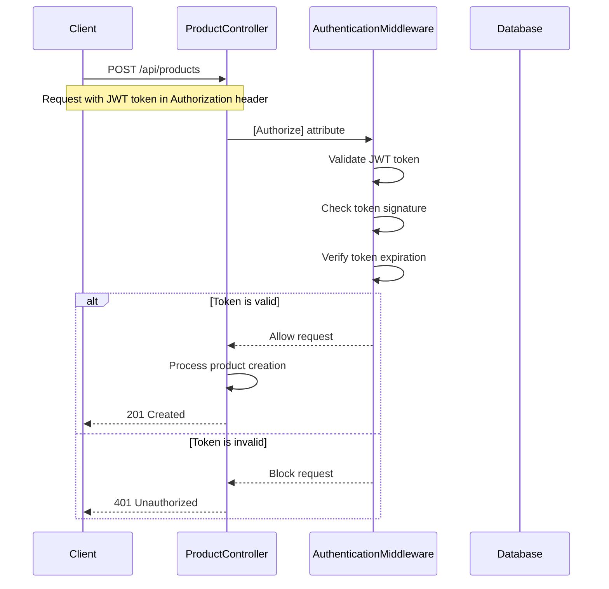
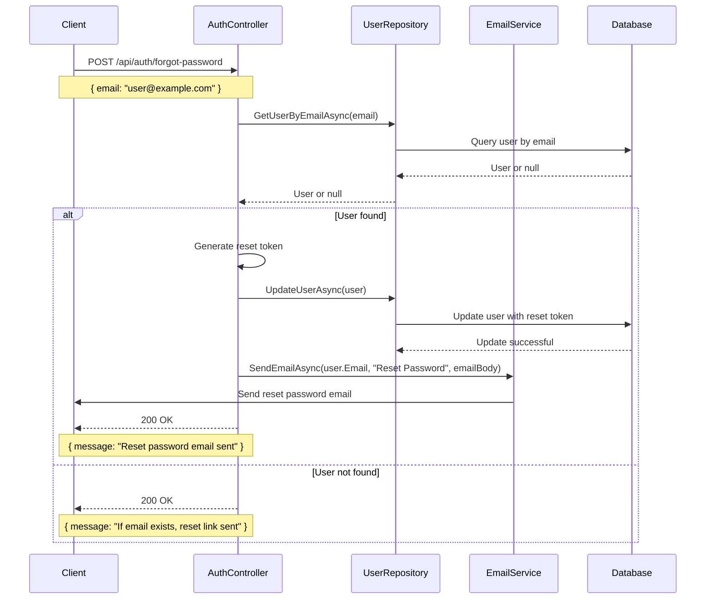

# Authentication Flow for Product Creation API

## 1. Authentication Flow Overview

```mermaid
sequenceDiagram
    participant Client
    participant ProductController
    participant AuthenticationMiddleware
    participant Database

    %% Authentication Flow
    Client->>ProductController: POST /api/products
    Note over Client,ProductController: Request with JWT token in Authorization header
    
    ProductController->>AuthenticationMiddleware: [Authorize] attribute
    AuthenticationMiddleware->>AuthenticationMiddleware: Validate JWT token
    AuthenticationMiddleware->>AuthenticationMiddleware: Check token signature
    AuthenticationMiddleware->>AuthenticationMiddleware: Verify token expiration
    
    alt Token is valid
        AuthenticationMiddleware-->>ProductController: Allow request
        ProductController->>ProductController: Process product creation
        ProductController-->>Client: 201 Created
    else Token is invalid
        AuthenticationMiddleware-->>ProductController: Block request
        ProductController-->>Client: 401 Unauthorized
    end
```

## 2. Forgot Password Flow

```mermaid
sequenceDiagram
    participant Client
    participant AuthController
    participant UserRepository
    participant EmailService
    participant Database

    %% Forgot Password Flow
    Client->>AuthController: POST /api/auth/forgot-password
    Note over Client,AuthController: { email: "user@example.com" }
    
    AuthController->>UserRepository: GetUserByEmailAsync(email)
    UserRepository->>Database: Query user by email
    Database-->>UserRepository: User or null
    UserRepository-->>AuthController: User or null
    
    alt User found
        AuthController->>AuthController: Generate reset token
        AuthController->>UserRepository: UpdateUserAsync(user)
        UserRepository->>Database: Update user with reset token
        Database-->>UserRepository: Update successful
        
        AuthController->>EmailService: SendEmailAsync(user.Email, "Reset Password", emailBody)
        EmailService->>Client: Send reset password email
        
        AuthController-->>Client: 200 OK
        Note over Client,AuthController: { message: "Reset password email sent" }
    else User not found
        AuthController-->>Client: 200 OK
        Note over Client,AuthController: { message: "If email exists, reset link sent" }
    end
```