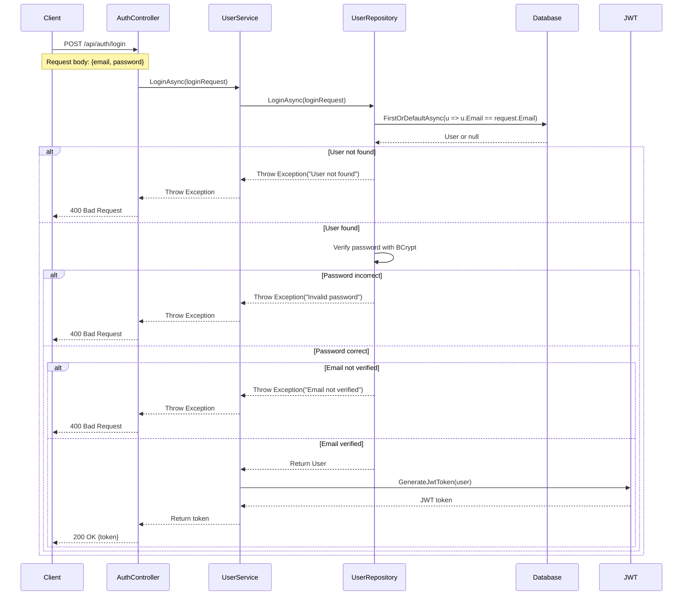

# Login API Sequence Diagram

## Overview
This document describes the sequence of operations when a user attempts to log in to the system.

## Sequence Diagram



## Flow Explanation

1. **Client Request**:
    - Client sends a POST request to `/api/auth/login`
    - Request body contains email and password

2. **Controller Layer**:
    - `AuthController` receives the request
    - Calls `UserService.LoginAsync()`

3. **Service Layer**:
    - `UserService` calls `UserRepository.LoginAsync()`
    - If login successful, generates JWT token
    - Returns token to controller

4. **Repository Layer**:
    - `UserRepository` performs database operations
    - Finds user by email
    - Verifies password with BCrypt
    - Checks email verification status
    - Returns user if all checks pass

5. **Database**:
    - Executes query to find user by email
    - Returns user or null

6. **JWT Generation**:
    - Creates claims from user information
    - Signs token with secret key
    - Returns JWT token

7. **Response**:
    - Success (200 OK): Returns JWT token
    - Error (400 Bad Request): Returns error message

## Error Cases

1. **User Not Found**:
   ```json
   {
       "message": "User not found"
   }
   ```

2. **Invalid Password**:
   ```json
   {
       "message": "Invalid password"
   }
   ```

3. **Email Not Verified**:
   ```json
   {
       "message": "Email not verified"
   }
   ```

## Security Features

1. **Password Security**:
    - Passwords are hashed using BCrypt
    - Salt is automatically generated and stored with the hash

2. **Token Security**:
    - JWT tokens are signed with a secret key
    - Tokens expire after 1 hour
    - Tokens contain minimal necessary user information

3. **Email Verification**:
    - Email verification is required before login
    - Prevents unauthorized access

4. **Error Handling**:
    - Clear error messages for different failure cases
    - No sensitive information is exposed in error responses 